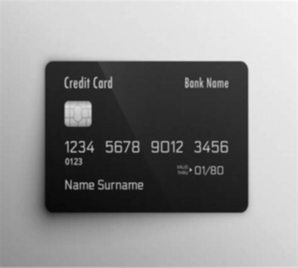
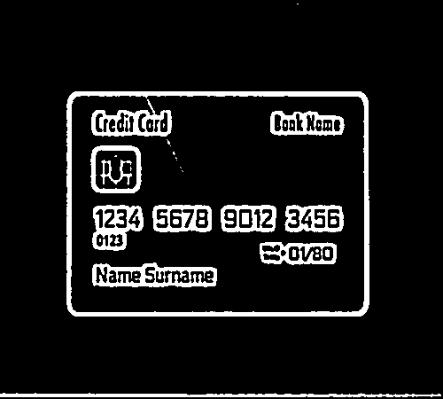

In this part we clean the image and also find the credit card and apply the perspective transform using Numpy and openCV2.

### The processing part includes different parts :
1-Resize the image to have a smaller image.

2-Get the grayscale image.

3-Apply blur filter on the image.

4-Apply a threshold filter on the image to have an image with binary colors.

5-Get the contours of the credit card.

6-Normalize the contours and get the perspective transform.

7-Get the opening process on the image to have the main patterns of the digits.

8-Crop the image to have the groups of numbers.

9-Get the contours of the 4 digits in each group.

10-Get each digit image in a list and return the list.
