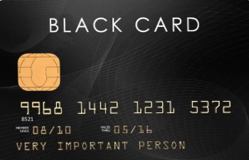
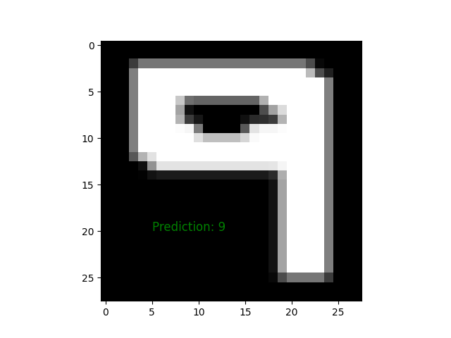

# Credit_Card_OCR API
This project is about detect and extracts some data from a credit card image using: openCV and Tesseract and then detect if the credit card is a fraud by using an AI.
Not finished yet

## In this project we will use Python.

### Step 1 : 
Image processsing : Detect the credit card and cleanup the image with openCV.

Image of the perspective transform.

Image of the group of digits extracted from the original image.

Image of one digit extracted from the group of digits from the last big step.

### Step 2 :
Digits recognition with CNN model (Python). If you want to have more details about this part you need to go in the AI part of the repository.

Here we can see that the model is trained on the font OCR-A because it's the most used font for credit card. The model predicted a 9 here (correct).

### Step 3 :
Part that need to be redefined

### Backhend part (API):
#### Backhend framework to develop the API : Django (Python).
#### Packaging, deployment, and management of the API : Docker
